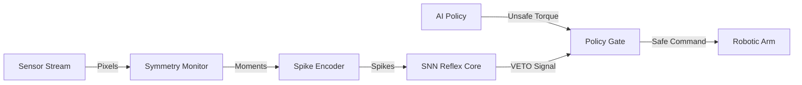

# Event-Driven Reflex Control on FPGA


A hardware-based safety layer for robotic manipulation. This FPGA core acts as a parallel "spinal cord," monitoring geometric stability in real-time and vetoing unsafe AI commands in **< 1 µs**.

## Problem vs. Solution

| Feature | Software Control (ROS/Python) | FPGA Reflex (This Project) |
|---------|-------------------------------|----------------------------|
| **Latency** | ~10-50 ms (OS Jitter) | **< 1 µs (Deterministic)** |
| **Safety** | Reactive (Post-failure) | **Pre-emptive (Pre-failure)** |
| **Role** | High-level Planning | **Low-level Hardware Veto** |

## System Architecture



## Performance Verification

### 1. Hardware-in-the-Loop (HIL) Validation

Validated using PyBullet physics engine to simulate a micro-slip event. The FPGA detects the slip onset and triggers the reflex before the object drops.


*Figure 1: `drift_metric` (Green) spikes upon slip detection. `reflex_active` fires immediately, forcing motor output to 0.*

### 2. FPGA Resource Utilization (Yosys Synthesis)

Synthesized for low-power edge FPGAs (e.g., Artix-7). The SNN core is highly efficient, consuming only ~11% of the total logic.

| Module | Logic Cells | Flip-Flops | Est. Logic Depth |
|--------|-------------|------------|------------------|
| Symmetry Monitor | 4,148 | 136 | ~22 |
| Spike Encoder | 1,812 | 86 | ~12 |
| SNN Reflex Core | 747 | 37 | ~6 |
| Policy Gate | 188 | 34 | ~2 |
| **Total System** | **6,895** | **293** | **~22** |

## Quick Start

**Prerequisites:** `iverilog`, `gtkwave`, `python3`, `pybullet`

### 1. Generate Physics Trace

Run the robotic simulation:

```bash
cd python_model
python3 generate_grasp_trace.py
cd ..
```

### 2. Run RTL Simulation

Feed trace to Verilog:

```bash
iverilog -o grasp_sim tb/tb_pybullet_replay.v rtl/*.v
vvp grasp_sim
```

### 3. View Waveforms

```bash
gtkwave pybullet_wave.vcd
```

## Repository Structure

* `rtl/`: Synthesizable Verilog source (LIF Neuron, Rate Encoder).
* `tb/`: Testbenches for HIL replay.
* `python_model/`: PyBullet physics scripts.
* `results/`: Validation artifacts and synthesis logs.

---

*Verified on macOS via Icarus Verilog & Yosys Open-Source Flow.*