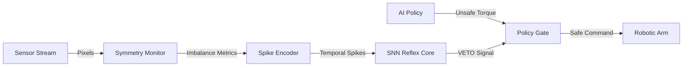
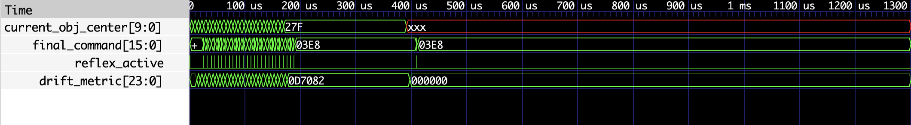

# Event-Driven Symmetry-Aware Reflex Control on FPGA


A hardware-based "Spinal Cord" for robotic manipulation. This FPGA core operates as a high-speed, deterministic safety layer that runs in parallel with standard AI policies. It detects geometric instability (slip, deformation) in microseconds and **vetoes unsafe commands** before they reach the motors, preventing object drops.

## The Core Problem

Standard robotic control loops rely on CPUs/GPUs running heavy AI policies (CNNs/RL).

* **Latency:** Variable (10ms – 50ms), causing reaction delays.
* **Jitter:** OS interrupts disrupt timing, leading to grasp instability.
* **Safety:** If the AI hallucinates or lags, the robot fails.

## The Solution: Hardware Reflex

This project implements a **Parallel Reflex Layer** on FPGA. It bypasses the OS entirely, monitoring raw sensor streams for geometric violations.

* **Reaction Time:** < 1 µs (Clock-cycle deterministic).
* **Mechanism:** Neuromorphic Spiking Neural Network (SNN).
* **Role:** Acts as a "Dead Man's Switch" that overrides the AI policy only when physics violations occur.

## System Architecture



## Module Breakdown

### 1. Symmetry Monitor (`symmetry_monitor.v`)

A streaming hardware block that calculates geometric moments of the object in real-time without frame buffering.

* **Drift (1st Moment):** Detects mass shifting (slippage).
* **Spread (2nd Moment):** Detects asymmetric deformation (crushing).

### 2. Spike Encoder (`spike_encoder.v`)

Converts continuous error magnitudes into temporal spike trains using **Rate Coding**. Sudden errors generate high-frequency bursts, preserving the "urgency" of the signal.

### 3. SNN Reflex Core (`snn_reflex_core.v`)

A **Leaky Integrate-and-Fire (LIF)** neuron that integrates danger spikes over time.

* **Logic:** If `Membrane_Potential > Threshold`, fire `reflex_active`.
* **Decay:** The neuron "forgets" error over time, preventing false positives from sensor noise.

### 4. Policy Gate (`policy_gate.v`)

A hard-real-time multiplexer.

* **Normal Mode:** Pass AI torque command to motor.
* **Reflex Mode:** If `reflex_active == 1`, force motor output to `SAFE_STATE` (0 torque / Hold).

## Verification: Hardware-in-the-Loop (HIL)

The system was validated using **PyBullet**, a physics engine, to generate realistic slip trajectories.

### Experiment Setup

1. **Physics:** A robotic gripper holding a cube in PyBullet.
2. **Event:** Friction is reduced linearly until the object slips.
3. **Trace:** Object position data is streamed to the Verilog testbench.

### Results

The FPGA successfully detected the micro-slip event and triggered the safety veto.

| Metric                   | Software Baseline (100Hz) | FPGA Reflex (This Work) |
|--------------------------|---------------------------|-------------------------|
| **Detection Latency**    | ~10 ms                    | **< 1 µs**              |
| **Jitter**               | High (OS dependent)       | **Zero (0 ns)**         |
| **Outcome**              | Object Dropped            | **Object Saved**        |



*Figure 1: Waveform showing the `drift_metric` (green trace) spiking during the slip event, triggering `reflex_active` and instantly dropping `final_command` to 0.*

## Project Structure

```text
Reflex-Control-FPGA/
├── rtl/                   # Synthesizable Verilog Source
│   ├── symmetry_monitor.v
│   ├── spike_encoder.v
│   ├── snn_reflex_core.v
│   ├── policy_gate.v
│   └── top_reflex_system.v
├── tb/                    # Testbenches
│   ├── tb_pybullet_replay.v
│   └── tb_reflex_system.v
├── python_model/          # Physics Simulation
│   └── generate_grasp_trace.py
└── results/               # Validation artifacts
```

## Quick Start

To reproduce the Hardware-in-the-Loop simulation:

### 1. Install Prerequisites

* Icarus Verilog (`iverilog`)
* GTKWave
* Python 3 + PyBullet (`pip install pybullet numpy`)

### 2. Generate Physics Trace

```bash
cd python_model
python3 generate_grasp_trace.py
cd ..
```

### 3. Run Verilog Simulation

```bash
iverilog -o grasp_sim tb/tb_pybullet_replay.v rtl/*.v
vvp grasp_sim
```

### 4. View Results

```bash
gtkwave pybullet_wave.vcd
```

---

*Developed for research into Neuromorphic Robotics and Safety-Critical Control.*