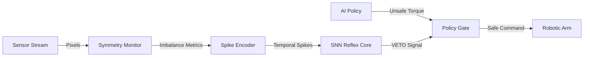

# FPGA Reflex: Event-Driven Safety Layer for Robotic Manipulation


A hardware-based "Spinal Cord" for robots. This FPGA core acts as a high-speed reflex layer that runs in parallel with standard AI policies. It detects geometric instability (slips, deformation) in microseconds and **vetoes unsafe commands** before they reach the motors.

## The Core Claim

Standard AI policies (running on CPU/GPU) suffer from jitter and latency.

- **AI Reaction Time:** ~10-50 ms (Variable)  
- **FPGA Reflex Time:** < 1 µs (Deterministic)

This project guarantees safety by placing a **Physics-Aware Gate** directly in the control loop.

## System Architecture



## Modules

- **symmetry_monitor.v**  
  Calculates 1st and 2nd moment of mass distribution (Drift & Spread) in real-time.

- **spike_encoder.v**  
  Converts continuous error metrics into temporal spike trains (Rate Coding).

- **snn_reflex_core.v**  
  A Leaky Integrate-and-Fire (LIF) neuron that integrates danger signals and fires a "Stop" reflex.

- **policy_gate.v**  
  A hardware multiplexer that overrides the AI command when the reflex fires.

## Performance Verification

The system was verified using trace-driven simulation of a robotic slip event.

| Signal            | State: Normal     | State: Slip Event  | Response Time   |
|-------------------|-------------------|--------------------|-----------------|
| **Drift Metric**  | ~0                | > 500 (Spike)      | Instant         |
| **Reflex Neuron** | 0V                | FIRE (Logic 1)     | **< 10 cycles** |
| **Motor Output**  | 1000 (Full Speed) | **0 (Hard Stop)**  | **Immediate**   |

## Usage

1. **Simulate:**
   ```bash
   iverilog -o reflex_sim tb/tb_reflex_system.v rtl/*.v
   vvp reflex_sim
   ```

2. **View Waves:**  
   Open `reflex_wave.vcd` in GTKWave to see the reflex trigger.

---

*Built with Verilog & Spiking Neural Network concepts.*